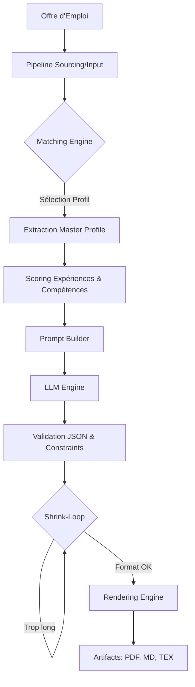

# Spécifications Techniques — Job Copilot (Cerveau V5)

Ce document détaille l'architecture technique, les algorithmes et la structure des données du projet **Job Copilot**. Ce système est conçu pour automatiser la génération de CV sur-mesure tout en garantissant un format optimal (One-Page) et une pertinence maximale vis-à-vis des offres d'emploi.

---

## 🏗 Architecture Système

Le projet suit une architecture modulaire dite "Lean", privilégiant la vitesse d'exécution et la robustesse des prompts LLM.

### Diagramme de Flux de Données

---

## 🧠 Le Cerveau (Matching Engine)

Le cœur de l'intelligence du système (`engine/matching.py`) repose sur une approche heuristique robuste avant même l'appel au LLM.

### 1. Sélection de Profil
Le système compare les mots-clés de l'offre d'emploi avec les `target_keywords` des profils définis dans `profiles/master_profile.json`. En cas d'absence de match significatif, un profil de repli (`simulation_rd`) est utilisé.

### 2. Stratégie de Filtrage des Compétences (3-Layer Skills)
Pour optimiser l'espace et la pertinence, les compétences sont filtrées en trois couches :
- **Couche 1 (Signature)** : Compétences directement liées aux mots-clés du profil cible.
- **Couche 2 (Transversale)** : Compétences outils indispensables (Python, Git, MATLAB, etc.) via une whitelist technique.
- **Couche 3 (Contextuelle)** : Reste des compétences triées par niveau et proximité avec les expériences sélectionnées.

### 3. Scoring des Expériences
Les expériences sont classées selon leur tag de profil (`profiles_tags`) et le chevauchement avec les mots-clés de l'offre (`K`). Le système garantit également la présence de **Projets Académiques** (Pool B) en plus des **Expériences Professionnelles** (Pool A).

---

## 🔄 L'Algorithme Shrink-Loop

C'est l'innovation majeure (`engine/cv_generator.py`) pour garantir le format **One-Page**.

Le système réalise jusqu'à 4 tentatives (`SHRINK_CONFIGS`) avec des contraintes de plus en plus strictes :
- **Tentative 1** : Contenu riche, police standard (9.5pt), espacements normaux.
- **Tentative 2-4** : Réduction progressive du nombre de bullets, de la taille de la police (jusqu'à 8.0pt), et des marges.
- **Garantie** : Si le rendu PDF dépasse une page, le système descend d'un cran dans la boucle de compression.

---

## 🤖 Prompt Engineering & LLM

### Stratégie "Single Call"
Contrairement aux architectures multi-agents complexes, ce projet utilise un **seul appel structuré** vers le LLM. Le prompt contient :
- Des contraintes de style strictes (interdiction des termes "Étudiant", "Apprenti").
- Un schéma de sortie JSON imposé.
- Des limites de caractères par section (Headline, Summary, Bullets).

### Moteurs Supportés (`engine/engines.py`)
- **Gemini (Cloud)** : Moteur principal via API Google.
- **MLX (Local)** : Optimisé pour Apple Silicon (Apple MLX Framework).
- **Ollama (Local)** : Support pour Llama/Mistral via l'API Ollama locale.

---

## 🎨 Rendering Pipeline (`engine/rendering.py`)

Le système supporte plusieurs formats de sortie, avec une priorité sur le rendu premium.

| Format | Outil | Usage |
| :--- | :--- | :--- |
| **PDF** | **Typst** | Rendu professionnel avec gestion dynamique des variables système. |
| **Markdown** | Natif | Version légère pour lecture rapide ou intégration web. |
| **Latex** | ModernCV | Format standard académique, utile pour des modifications manuelles. |

---

## 📁 Structure des Données (`master_profile.json`)

Le fichier de données est hautement structuré pour alimenter le moteur :
- `personal_info` : Identité et réseaux.
- `experience_stark` : Expériences encodées en format **STAR-K** (Situation, Task, Action, Result, Keywords).
- `skills_taxonomy` : Référentiel complet des compétences.
- `education` : Parcours académique détaillé.

---

## 🛠 Tech Stack

- **Backend** : Python 3.9+
- **Interface** : Streamlit (Dashboard temps réel)
- **Base de données** : SQLite (via `storage/jobs.db`)
- **Rendering** : Typst (Module Python `typst`)
- **LLMs** : Google Gemini, Ollama, Apple MLX.
