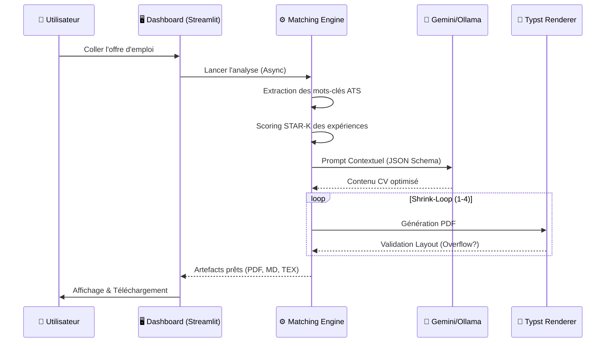

# 📑 Spécifications Techniques — Job Copilot (Cerveau V5)

Ce document définit l'architecture logicielle, les algorithmes de décision et le pipeline de rendu du projet **Job Copilot**. L'objectif est de transformer un profil brut en un document d'ingénierie optimisé, prêt pour les systèmes ATS (Applicant Tracking Systems).

---

## 🏗 Architecture Système

Le système repose sur une architecture **Event-Driven & Asynchrone**. Le dashboard Streamlit communique avec un moteur de calcul via un `ThreadRunner` pour garantir une interface fluide sans blocage durant les appels LLM.

### Flux de Données Global

---

## 🧠 Le Moteur de Décision (Matching Engine)

### 1. Méthodologie STAR-K
Le projet utilise une extension du framework STAR (Situation, Task, Action, Result) en y ajoutant la dimension **Keywords (K)**. 
- **S**ituation : Contexte du projet.
- **T**ask : Problématique technique rencontrée.
- **A**ction : Méthodes d'ingénierie déployées (Python, CFD, FEA).
- **R**esult : Impact quantifié (ex: -15% de consommation).
- **K**eywords : Tags pour le matching sémantique.

### 2. Algorithme de Scoring Sémantique
Le calcul de pertinence ($S$) d'une expérience pour une offre donnée suit la logique suivante :
$$S = (W_{profile} \times 0.4) + (W_{keywords} \times 0.6) - P_{obsolescence}$$

Où :
- $W_{profile}$ : Match avec le domaine cible (Energie, Simulation, etc.).
- $W_{keywords}$ : Fréquence des mots-clés de l'offre dans les tags STAR-K.
- $P_{obsolescence}$ : Pénalité linéaire pour les expériences de plus de 5 ans.

---

## 🔄 L'Algorithme "Shrink-Loop" (Innovation)

Garantir un **CV d'une seule page** sans perte de contenu majeur est un défi technique résolu par une boucle de rétroaction sur le layout.

> [!TIP]
> **Le Concept :** Au lieu de couper le texte, on ajuste la densité informationnelle et la micro-typographie.

| Niveau | Taille Police | Marges | Max Bullets | Stratégie |
| :--- | :--- | :--- | :--- | :--- |
| **Normal** | 10pt | 1.5cm | 5 | Contenu exhaustif, aéré. |
| **Compact** | 9.5pt | 1.2cm | 4 | Suppression des adjectifs superflus. |
| **Dense** | 9pt | 1.0cm | 3 | Fusion de lignes, réduction interligne. |
| **Critical** | 8.5pt | 0.8cm | 3 | Formatage ultra-compact (Last Resort). |

---

## 🤖 Pipeline LLM (Intelligence Artificielle)

### Stratégie de Prompting
Le système utilise un **"Massive System Prompt"** qui force le LLM à agir comme un recruteur expert en ingénierie.
- **Contraintes de ton** : Professionnel, factuel, orienté résultats.
- **Interdiction de Hallucination** : Le LLM ne peut utiliser *que* les données du `master_profile.json`.
- **Validation** : Utilisation de `Pydantic` (ou validation JSON stricte) pour s'assurer que la sortie est compatible avec le moteur de rendu.

---

## 🎨 Rendering Engine (La Puissance de Typst)

Le projet abandonne LaTeX au profit de **Typst**, un nouveau système de rendu typographique écrit en Rust.
- **Vitesse** : Rendu < 100ms (contre plusieurs secondes pour pdflatex).
- **Flexibilité** : Syntaxe programmable pour injecter dynamiquement des couleurs et des icônes selon le profil.
- **Format de sortie** : PDF haute définition, Markdown pour le web, et code source Typst pour retouches fines.

---

## 🛠 Stack Technique & Dépendances

- **Langage** : Python 3.11+
- **Frontend** : Streamlit (Premium Custom CSS)
- **Base de données** : SQLite (Gestion persistante du pipeline de candidatures)
- **IA** : Gemini Flash 1.5 (API), Ollama/MLX pour le support local.
- **Rendu** : Typst CLI & Library.

---
*Ce document fait partie de l'écosystème **Job Copilot** — Version 5.2 (Avril 2026)*
