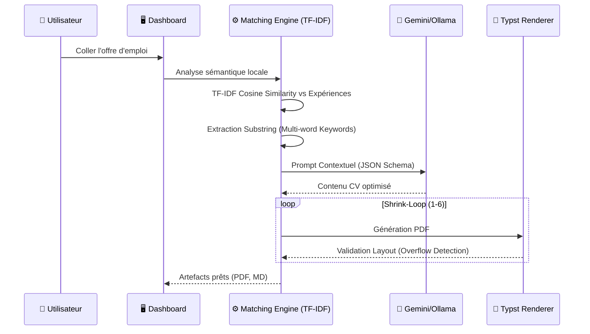

# 📑 Spécifications Techniques — Job Copilot (Cerveau V5.3)

Ce document définit l'architecture logicielle, les algorithmes de décision et le pipeline de rendu du projet **Job Copilot**, mis à jour avec les avancées de **Mai 2026**.

---

## 🏗 Architecture Système

Le système repose sur une architecture **Event-Driven & Asynchrone**. Le dashboard Streamlit communique avec un moteur de calcul via un `ThreadRunner`.

### Flux de Données Global (Sémantique)

---

## 🧠 Le Moteur de Décision (Matching Engine)

### 1. Sélection du Profil (Heuristique)
Le système sélectionne le profil le plus pertinent (ex: `simulation_rd`, `data_science`) en fonction de l'occurrence des **mots-clés cibles** dans l'offre.
- **Fallback** : En l'absence de match clair, le profil par défaut (`simulation_rd`) est utilisé.

### 2. Scoring Hybride des Expériences
Le classement des expériences professionnelles et projets académiques utilise un **Double Score** pour maximiser la pertinence :
- **Score Heuristique ($S_{tags}$)** : Basé sur les `profiles_tags` (ex: `all`, `simulation_rd`) et le match direct des mots-clés `K`.
- **Score Sémantique ($S_{tfidf}$)** : Calculé via `LocalExperienceMatcher` utilisant `scikit-learn`. Une matrice TF-IDF est construite sur le corpus des expériences + la description de l'offre.
- **Formule Combinée** : $Score = S_{tags} + (S_{tfidf} \times 10)$. Ceci permet de départager sémantiquement des expériences ayant des tags identiques.

### 3. Sélection des Skills en 3 Couches (3-Layer Logic)
La sélection des 12 compétences (Hard Skills) suit une hiérarchie stricte pour garantir un équilibre entre expertise et polyvalence :
- **Layer 1 : Signature (Top-Down)** : Compétences directement liées aux mots-clés du profil sélectionné.
- **Layer 2 : Transversales (Whitelist)** : Compétences outils indispensables (Git, Linux, Python, Matlab) via une liste de marqueurs.
- **Layer 3 : Contextuelles (Bottom-Up)** : Pool de compétences trié par niveau (Avancé > Débutant) avec un **boost de pertinence** si la compétence apparaît dans les expériences sélectionnées pour le CV.

### 4. Extraction de Mots-clés Avancée
- **Substring Matching** : Le moteur cherche des **locutions techniques complexes** ("Ansys Workbench", "Calcul statique linéaire") par recherche de sous-chaînes exactes pour éviter de rater les compétences critiques ATS.

---

## 🔄 L'Algorithme "Shrink-Loop" (Reinforced)

Garantir un **CV d'une seule page** est désormais un contrat de résultat sur 6 tentatives.

| Niveau | Police | Leading | Section Gap | Stratégie Contenu |
| :--- | :--- | :--- | :--- | :--- |
| **1-2** | 10.4-9.8pt | 0.65-0.58 | 16-14pt | Contenu standard, réduction douce. |
| **3-4** | 9.2pt | 0.55 | 10-6pt | Réduction du nombre d'expériences et de projets. |
| **5-6 (Extreme)** | 8.8-8.5pt | 0.52-0.50 | 5-4pt | **Culling** : Suppression des modules éducation, 1 seule puce par exp. |

> [!IMPORTANT]
> **Zéro Troncature Sauvage** : Le système préfère supprimer un élément complet (une puce, un projet) ou réduire la police plutôt que de couper une phrase au milieu. La cohérence sémantique est prioritaire.

---

## 🤖 Pipeline LLM & Axe Qualité

### Stratégie "Senior Pivot"
Le système impose des contraintes éditoriales strictes pour transformer le profil, agissant à deux niveaux :

#### A. Diagnostic & Transformation (Ground Truth)
Avant la génération, les données sources sont nettoyées via des outils dédiés :
- **`scripts/audit_seniority.py`** : Scan récursif du `master_profile.json` pour détecter les marqueurs "étudiants" (regex word boundaries pour PFE, Stage, S7-S9, TP).
- **`scripts/seniorize_profile.py`** : Script de transformation automatique qui professionnelise le contenu :
    - Remplace `academic_project` par `specialized_mission`.
    - Mappe les IDs (ex: `AM_PFE` → `AM_RD_PILOT`).
    - Épure les références aux semestres académiques.

#### B. Contraintes Éditoriales LLM
- **Anti-Student Language** : Interdiction formelle des termes "étudiant", "élève", "apprentissage" dans le prompt.
- **Action-Oriented** : Utilisation systématique de verbes d'action au participe passé (Conçu, Modélisé, Optimisé).
- **Keyword Weaving** : Injection forcée des mots-clés détectés par le moteur TF-IDF dans le corps du résumé et des expériences.

---

## 🛠 Stack Technique & Dépendances

- **Langage** : Python 3.11+
- **Data Science** : Scikit-learn (TF-IDF Vectorization, Cosine Similarity)
- **Frontend** : Streamlit (Custom Premium CSS)
- **Rendu** : Typst CLI (Rendu ultra-rapide en Rust)
- **IA** : Gemini Flash 1.5 (API), MLX/Ollama pour support local.

---
*Ce document fait partie de l'écosystème **Job Copilot** — Version 5.3 (Mai 2026)*
